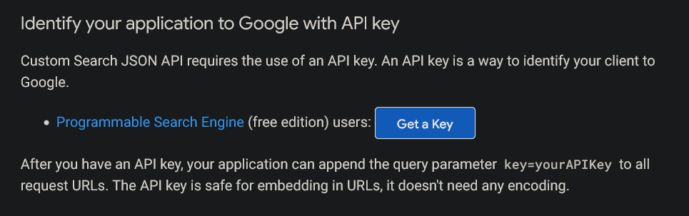
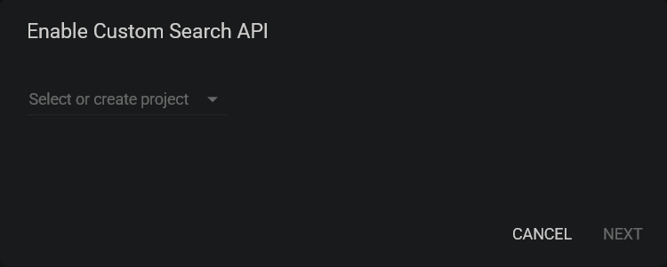
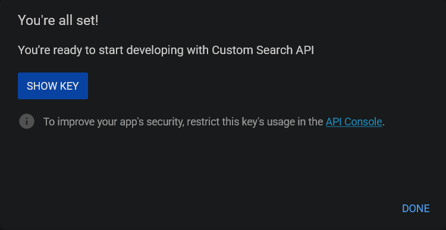

# Ebook Search

A simple ebook search tool that allows you to search for ebooks across multiple sources.

## Installation

### API Key

To use the Ebook Search application, you will need to obtain a Google Search API Key :

1. Go to the [Programmable Search Engine](https://developers.google.com/custom-search/v1/introduction#identify_your_application_to_google_with_api_key) page.
2. Click on "Get a Key" and follow the instructions to create a new API key. 
3. Select a project or create a new one. 
4. Copy the API key provided. 

### Custom Search Engine ID

To use the Ebook Search application, you will also need to create a Custom Search Engine (CSE):
1. Go to the [Custom Search Engine](https://cse.google.com/) page.
2. Click on "Add" to create a new search engine.
3. Fill in the required fields, such as the name and sites to search. You can leave the sites field empty to search the entire web.
4. Click on "Create" to create the search engine.
5. Once created, it should show you the HTML script to add to your website :
    ```html
    <script async src="https://cse.google.com/cse.js?cx=YOUR_CSE_ID">
    </script>
    <div class="gcse-search"></div>
    ```
    It's the `cx` parameter that contains your Custom Search Engine ID.

### Installation Steps

1. Clone the repository
2. Install the required packages using pip:
   ```bash
   pip install -r requirements.txt
   ```
3. Set up the environment variables by copying the `.env.example` file to `.env` and filling in the required values.
4. Run the application:
   ```bash
   python main.py
   ```

## Environment Variables

The following environment variables are required:

- `API_KEY`
- `SEARCH_ENGINE_ID`
- `KEYWORDS` (you could search without it, but the tools looses its purpose...)

The following environment variables are optional:

- `FILETYPES`: Comma-separated list of file types to search for (if you don't specify, it will search for all web pages). Usually ebooks sites do not index on Google their files directly, so I usually recommend to search for the web pages, and then on them check the torrent or direct download links.
- `MAX_RESULTS_PER_SITE`: Maximum number of results to return per site (default is 10).

## Results

A summary is printed to the console, but the raw data is in a CSV file.

## Contributing

Contributions are welcome! If you have any suggestions or improvements, feel free to open an issue or submit a pull request.

For instance I dropped mid-way my attemp to setup it of Google Colab, so if you want that functionality, feel free to implement it and submit a PR.

## License

This project is licensed under the MIT License - see the [LICENSE](LICENSE) file for details.